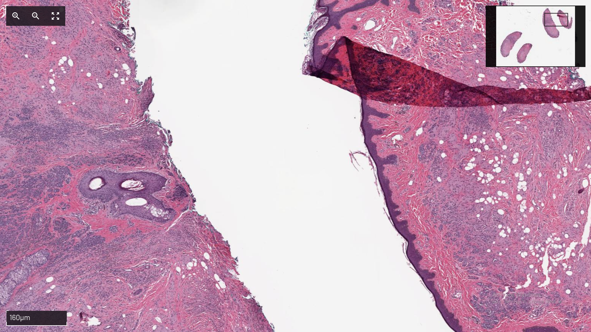

## About
Open Pyramid is a javascript library inspired by the [OpenSeadragon Project](https://openseadragon.github.io/) which displays Deep Zoom Images. This implimentation aims to create a simpler code base to achieve the same results and provide an easy to use interface to create additional features on top of the image display. The project is currently under development.

## Demo
To try out the library view the README in the src folder. The library code is placed in src/web_server/static/javascript/open-pyramid.

## Release
There is currently no release version of the library.
